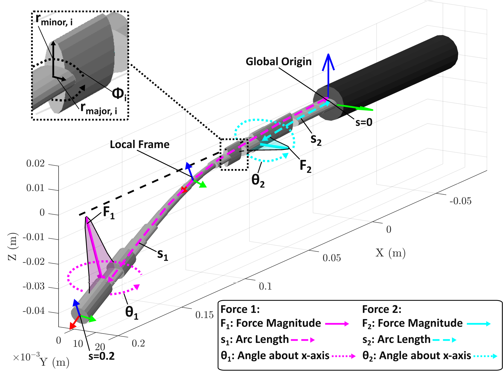

# Bioinspired Backbone Geometry for Continuum Robot Force Estimation

**Noah Jones · UC San Diego, Morimoto Lab · MS Thesis 2025**

---

## What is this?

Surgical continuum robots often brush against tissue at multiple points simultaneously. Knowing *where* and *how hard* those contacts are is critical for patient safety — but getting that information is hard. Body-mounted force sensors are bulky, hard to sterilize, and impractical at small scales. Base-mounted sensors are practical, but typically don't provide enough information to recover all the contact variables.

This project takes a different approach: **encode the missing information directly into the shape of the robot backbone.** Inspired by the evolved geometry of animal whiskers (rats, seals, elephants), we treat the backbone's cross-sectional profile as a design variable and optimize it so that a single proximal force/torque sensor can uniquely recover multiple 3D contact forces along the body.

<p align="center">
  
</p>

*The robot backbone (200 mm, 20 links) is deflected by two simultaneous point forces, each parameterized by magnitude F, arc-length position s, and angle θ. A single 6-axis F/T sensor at the base measures the resulting wrench.*

---

## Key Results

Optimized geometries dramatically outperform conventional cylindrical backbones for multi-force estimation:

<p align="center">
  
</p>

| Metric | Cylindrical | Optimized | Improvement |
|---|---|---|---|
| Mean force error | 0.22 N | 0.04 N | **~5.5×** |
| Mean position error | 4.97 cm | 0.93 cm | **~5.3×** |

---

## How It Works

### Forward Model

Each link is parameterized with an elliptical cross-section (semi-axes `a`, `b`, rotation `φ`). The backbone is simulated using **SoRoSim** (MATLAB, Cosserat rod theory). Applied forces are modeled as narrow Gaussian distributions rather than true point loads — this dramatically improves numerical conditioning in the inverse solver.

<p align="center">
  
</p>

`forward_model(F, τ)` takes applied forces and tendon tensions → returns the 6-DOF proximal wrench `[Tx, Ty, Tz, Fx, Fy, Fz]`.

### Inverse Model

`inverse_model(Wm, τm)` runs a two-stage solver to recover the forces from a measured wrench:

1. **Global search** — Latin Hypercube Sampling generates 400 candidates across the bounded design space; the 5 lowest-residual candidates become seeds.
2. **Local refinement** — MATLAB trust-region-reflective nonlinear least squares refines each seed to tolerance `10⁻¹⁰`. Best result is returned.

### Design Optimization

`design_optimization.m` searches over 60 design variables (3 per link × 20 links) to find the backbone geometry that minimizes the Jacobian condition number κ(J) — averaged over 60 randomly sampled load cases. A Von Mises safety constraint prevents plastic deformation (Bambu PC, σ_yield ≈ 62 MPa). Uses LHS global search followed by SQP (`fmincon`).

---

## Hardware

<p align="center">
  
</p>

The custom test rig applies two independent 3D point forces simultaneously using:

- **Two-axis articulating gimbal** for arbitrary force direction
- **5× tensioning winches** (NEMA 17 + TMC2209 drivers, 256 microstep)
- **5× 1 kg load cells** with HX711 ADCs for tension feedback
- **ATI Mini40 IP65** 6-axis F/T sensor at the proximal end
- **Arduino Mega** running the author-created control script

The backbone is FDM 3D-printed in Bambu Lab Polycarbonate (PC) on a Bambu X1 Carbon. The SolidWorks parametric model is driven by an Excel Design Table, so printing a new geometry is as simple as exporting the optimized design vector.

---

## Repository Structure

```
forward_model.m              # Applies forces + tendon tensions → proximal wrench (SoRoSim wrapper)
inverse_model.m              # Recovers forces from measured wrench (2-stage nonlinear least squares)
forward_model_parallel.m     # Parallelized forward model for batch evaluation
inverse_model_parallel.m     # Parallelized inverse model
design_optimization.m        # Backbone geometry optimizer (LHS global + SQP local)
compute_jacobian.m           # Finite-difference Jacobian ∂W/∂F
apply_gaussian_force.m       # Converts point loads to discrete Gaussian distributions
calc_ellipse_vonmises.m      # Von Mises stress for elliptical cross-sections (safety check)
global_to_local.m            # Coordinate frame transforms
update_design.m              # Applies a design vector to the SoRoSim robot model
plot_robot.m                 # Visualizes deflected backbone, tendons, and applied forces
jacobian_tester.m            # Validates Jacobian computation
copyHandle.m                 # Deep copy for MATLAB handle objects
my_robot.mat                 # Saved baseline robot configuration

Arduino/                     # Arduino Mega control script (winches + load cells)
ATI Sensor Calibration/      # ATI Mini40 calibration files
CAD/                         # SolidWorks parametric backbone and test rig models
Figures/                     # Publication figures
Optimization Results/        # Saved optimizer outputs
my_robots/                   # Saved SoRoSim robot configurations
```

---

## Dependencies

- MATLAB R2023+ with:
  - [SoRoSim toolbox](https://github.com/SoRoSim/SoRoSim)
  - Optimization Toolbox (`fmincon`, `lsqnonlin`)
  - Statistics and Machine Learning Toolbox (Latin Hypercube Sampling)
- Arduino IDE (for hardware control)
- Bambu X1 Carbon + PC filament (for fabrication)

---

## Citation

```bibtex
@mastersthesis{jones2025whisker,
  title  = {Bioinspired Backbone Geometry for Continuum Robot Force Estimation},
  author = {Jones, Noah},
  school = {University of California San Diego},
  year   = {2025}
}
```

---

**Noah Jones** · noahloicjones@gmail.com · [Morimoto Lab, UC San Diego](https://sites.google.com/view/morimotolab)
